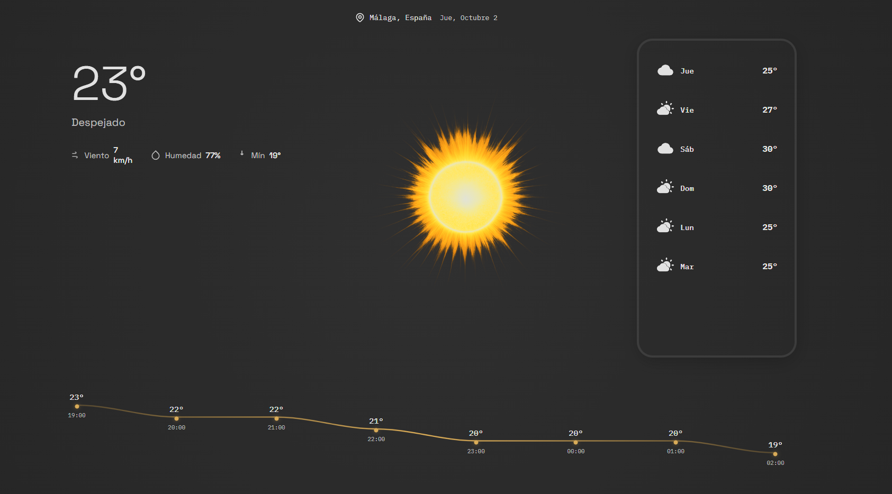

# 🌤️ WeatherApp

### Your Personal Weather Companion

A modern and elegant web application to check real-time weather conditions for any city worldwide.

[Report Bug](https://github.com/n3brrr/WeatherApp/issues)

---

## ✨ Features

🔍 **Geolocalitation** - Uses your location to give you accurate information

🌡️ **Real-time Data** - Up-to-date weather information instantly

💨 **Complete Metrics** - Temperature, humidity, wind speed, and more

🎨 **Responsive Design** - Works perfectly on any device

⚡ **Fast & Lightweight** - Smooth interface without heavy dependencies

## 🚀 Demo

  

